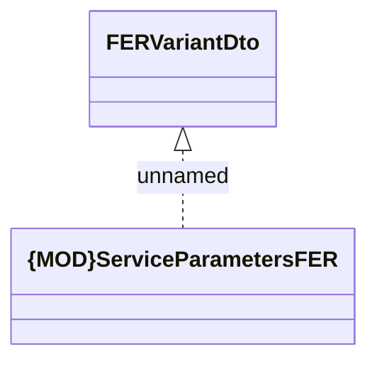

# FER Data

- **Diagram Type**: Logical
- **Package**: HomerSelect/BSL/Modules/Product Catalog (PRC)/Interface Provided/Product Catalog REST API/Services/Service Type Specific Extension/FER
- **Diagram ID**: 157038
- **Elements**: 2
- **Connectors**: 1

