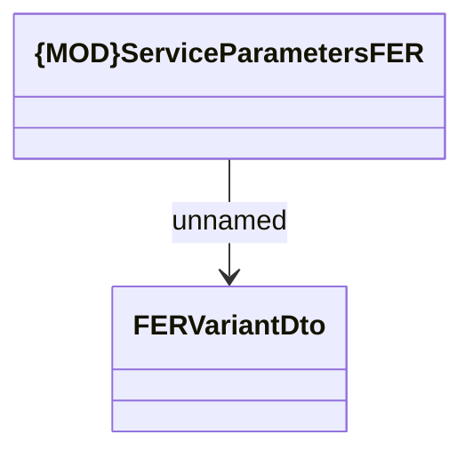

# FER Data

```mermaid
classDiagram
    class FERVariantDto["FERVariantDto"]
    class MOD_ServiceParametersFER["{MOD}ServiceParametersFER"]
    MOD_ServiceParametersFER --> FERVariantDto : unnamed
```
