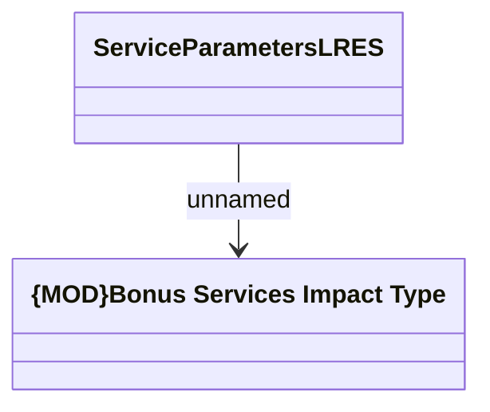

# LRES Data

```mermaid
classDiagram
    class MOD_Bonus_Services_Impact_Type["{MOD}Bonus Services Impact Type"]
    class ServiceParametersLRES["ServiceParametersLRES"]
    ServiceParametersLRES --> MOD_Bonus_Services_Impact_Type : unnamed
```
