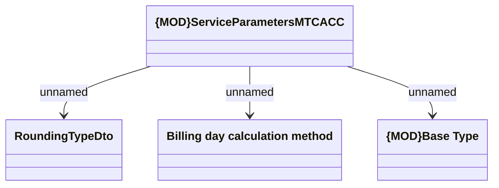

# MTCACC Data

```mermaid
classDiagram
    class MOD_Base_Type["{MOD}Base Type"]
    class Billing_day_calculation_method["Billing day calculation method"]
    class RoundingTypeDto["RoundingTypeDto"]
    class MOD_ServiceParametersMTCACC["{MOD}ServiceParametersMTCACC"]
    MOD_ServiceParametersMTCACC --> RoundingTypeDto : unnamed
    MOD_ServiceParametersMTCACC --> Billing_day_calculation_method : unnamed
    MOD_ServiceParametersMTCACC --> MOD_Base_Type : unnamed
```
