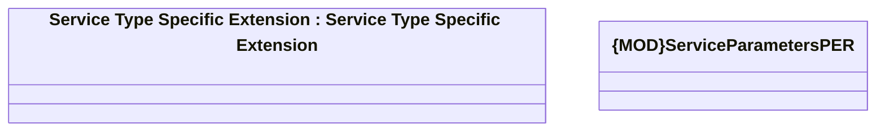

# PER Data

```mermaid
classDiagram
    class Service_Type_Specific_Extension_Service_Type_Specific_Extens["Service Type Specific Extension : Service Type Specific Extension"]
    class MOD_ServiceParametersPER["{MOD}ServiceParametersPER"]
```
