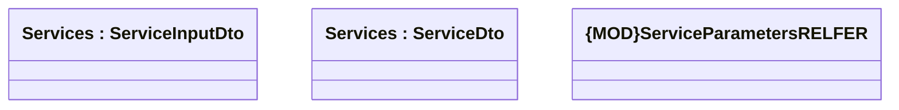

# RELFER Data

```mermaid
classDiagram
    class Services_ServiceInputDto["Services : ServiceInputDto"]
    class Services_ServiceDto["Services : ServiceDto"]
    class MOD_ServiceParametersRELFER["{MOD}ServiceParametersRELFER"]
```
