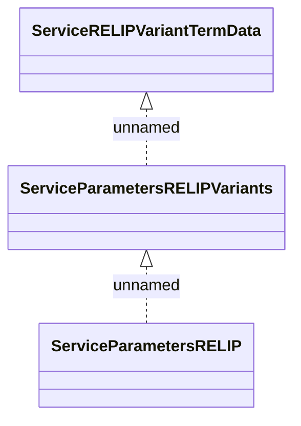

# RELIP Data

- **Diagram Type**: Logical
- **Package**: HomerSelect/BSL/Modules/Product Catalog (PRC)/Interface Provided/Product Catalog REST API/Services/Service Type Specific Extension/RELIP
- **Diagram ID**: 132037
- **Elements**: 3
- **Connectors**: 2

