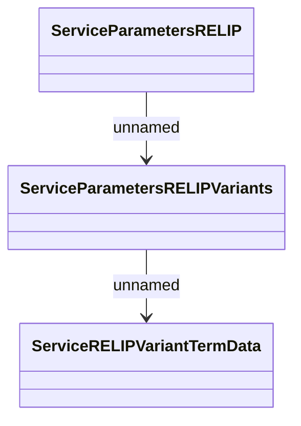

# RELIP Data

```mermaid
classDiagram
    class ServiceRELIPVariantTermData["ServiceRELIPVariantTermData"]
    class ServiceParametersRELIPVariants["ServiceParametersRELIPVariants"]
    class ServiceParametersRELIP["ServiceParametersRELIP"]
    ServiceParametersRELIP --> ServiceParametersRELIPVariants : unnamed
    ServiceParametersRELIPVariants --> ServiceRELIPVariantTermData : unnamed
```
