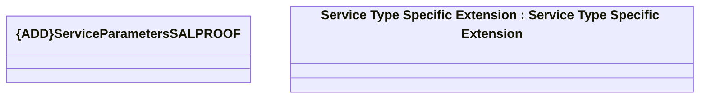

# SALPROOF Data

```mermaid
classDiagram
    class ADD_ServiceParametersSALPROOF["{ADD}ServiceParametersSALPROOF"]
    class Service_Type_Specific_Extension_Service_Type_Specific_Extens["Service Type Specific Extension : Service Type Specific Extension"]
```
