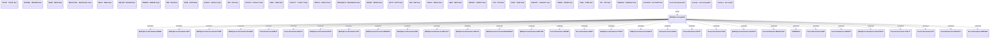

# Service Type Specific Extension

```mermaid
classDiagram
    class ADD_ServiceParametersIBACK["{ADD}ServiceParametersIBACK"]
    class ADD_ServiceParametersSALPROOF["{ADD}ServiceParametersSALPROOF"]
    class TOPUP_TOPUP_data["TOPUP : TOPUP data"]
    class MOD_ServiceParametersTOPUP["{MOD}ServiceParametersTOPUP"]
    class ZPROMO_ZPROMO_Data["ZPROMO : ZPROMO Data"]
    class ServiceParametersZPROMO["ServiceParametersZPROMO"]
    class SMSN_SMSN_Data["SMSN : SMSN Data"]
    class ServiceParametersRELPAYHOL["ServiceParametersRELPAYHOL"]
    class RELPAYHOL_RELPAYHOL_Data["RELPAYHOL : RELPAYHOL Data"]
    class RELIP_RELIP_Data["RELIP : RELIP Data"]
    class ServiceParametersRELIP["ServiceParametersRELIP"]
    class RELFER_RELFER_Data["RELFER : RELFER Data"]
    class MOD_ServiceParametersRELFER["{MOD}ServiceParametersRELFER"]
    class PREFDD_PREFDD_Data["PREFDD : PREFDD Data"]
    class MOD_ServiceParametersPREFDD["{MOD}ServiceParametersPREFDD"]
    class PER_PER_Data["PER : PER Data"]
    class MOD_ServiceParametersPER["{MOD}ServiceParametersPER"]
    class PAYM_PAYM_Data["PAYM : PAYM Data"]
    class MOD_ServiceParametersPAYM["{MOD}ServiceParametersPAYM"]
    class PAYHOL_PAYHOL_Data["PAYHOL : PAYHOL Data"]
    class MOD_ServiceParametersPAYHOL["{MOD}ServiceParametersPAYHOL"]
    class PAS_PAS_Data["PAS : PAS Data"]
    class MTCACC_MTCACC_Data["MTCACC : MTCACC Data"]
    class MOD_ServiceParametersMTCACC["{MOD}ServiceParametersMTCACC"]
    class LRES_LRES_Data["LRES : LRES Data"]
    class ServiceParametersLRES["ServiceParametersLRES"]
    class ServiceParametersLOYALTY["ServiceParametersLOYALTY"]
    class LOYALTY_LOYALTY_Data["LOYALTY : LOYALTY Data"]
    class IPPACK_IPPACK_Data["IPPACK : IPPACK Data"]
    class INSURANCE_INSURANCE_Data["INSURANCE : INSURANCE Data"]
    class MOD_ServiceParametersIPPACK["{MOD}ServiceParametersIPPACK"]
    class MOD_ServiceParametersINSURANCE["{MOD}ServiceParametersINSURANCE"]
    class MOD_ServiceParametersGRREL["{MOD}ServiceParametersGRREL"]
    class GRPER_GRPER_Data["GRPER : GRPER Data"]
    class ServiceParametersGRPER["ServiceParametersGRPER"]
    class GIFTP_GIFTP_Data["GIFTP : GIFTP Data"]
    class ServiceParametersGIFTP["ServiceParametersGIFTP"]
    class FER_FER_Data["FER : FER Data"]
    class MOD_ServiceParametersFER["{MOD}ServiceParametersFER"]
    class FBACK_FBACK_Data["FBACK : FBACK Data"]
    class ServiceParametersFBACK["ServiceParametersFBACK"]
    class DEFP_DEFP_Data["DEFP : DEFP Data"]
    class ServiceParametersDEFP["ServiceParametersDEFP"]
    class CRDPST_CRDPST_Data["CRDPST : CRDPST Data"]
    class ServiceParametersCRDPST["ServiceParametersCRDPST"]
    class COP_COP_Data["COP : COP Data"]
    class ServiceParametersCOP["ServiceParametersCOP"]
    class CONS_CONS_Data["CONS : CONS Data"]
    class ServiceParametersCONS["ServiceParametersCONS"]
    class CHECKTL_CHECKTL_Data["CHECKTL : CHECKTL Data"]
    class ServiceParametersCHECKTL["ServiceParametersCHECKTL"]
    class CHDDR_CHDDR_Data["CHDDR : CHDDR Data"]
    class CHDDRData["CHDDRData"]
    class CHDD_CHDD_Data["CHDD : CHDD Data"]
    class ServiceParametersCHDD["ServiceParametersCHDD"]
    class CET_CET_Data["CET : CET Data"]
    class MOD_ServiceParametersCET["{MOD}ServiceParametersCET"]
    class MOD_ServiceParametersCELREW["{MOD}ServiceParametersCELREW"]
    class BUNDLE1_BUNDLE1_Data["BUNDLE1 : BUNDLE1 Data"]
    class ACCSTMT_ACCSTMT_Data["ACCSTMT : ACCSTMT Data"]
    class MOD_ServiceParametersACCSTMT["{MOD}ServiceParametersACCSTMT"]
    class MOD_ServiceTypeDto["{MOD}ServiceTypeDto"]
    class ServiceParametersDto["ServiceParametersDto"]
    class Services_ServiceInputDto["Services : ServiceInputDto"]
    class Services_ServiceDto["Services : ServiceDto"]
    MOD_ServiceTypeDto --> MOD_ServiceParametersGRREL : unnamed
    MOD_ServiceTypeDto --> MOD_ServiceParametersPER : unnamed
    MOD_ServiceTypeDto --> MOD_ServiceParametersACCSTMT : unnamed
    MOD_ServiceTypeDto --> MOD_ServiceParametersCELREW : unnamed
    MOD_ServiceTypeDto --> ServiceParametersRELIP : unnamed
    MOD_ServiceTypeDto --> ServiceParametersFBACK : unnamed
    MOD_ServiceTypeDto --> MOD_ServiceParametersPAYM : unnamed
    MOD_ServiceTypeDto --> MOD_ServiceParametersCET : unnamed
    MOD_ServiceTypeDto --> MOD_ServiceParametersPREFDD : unnamed
    MOD_ServiceTypeDto --> MOD_ServiceParametersFER : unnamed
    MOD_ServiceTypeDto --> MOD_ServiceParametersMTCACC : unnamed
    MOD_ServiceTypeDto --> MOD_ServiceParametersIPPACK : unnamed
    MOD_ServiceTypeDto --> MOD_ServiceParametersINSURANCE : unnamed
    MOD_ServiceTypeDto --> MOD_ServiceParametersRELFER : unnamed
    MOD_ServiceTypeDto --> ServiceParametersGRPER : unnamed
    MOD_ServiceTypeDto --> ServiceParametersDEFP : unnamed
    ServiceParametersDto --> MOD_ServiceTypeDto : one of
    MOD_ServiceTypeDto --> MOD_ServiceParametersTOPUP : unnamed
    MOD_ServiceTypeDto --> ADD_ServiceParametersIBACK : unnamed
    MOD_ServiceTypeDto --> ServiceParametersLRES : unnamed
    MOD_ServiceTypeDto --> ServiceParametersGIFTP : unnamed
    MOD_ServiceTypeDto --> ServiceParametersCONS : unnamed
    MOD_ServiceTypeDto --> MOD_ServiceParametersPAYHOL : unnamed
    MOD_ServiceTypeDto --> ServiceParametersRELPAYHOL : unnamed
    MOD_ServiceTypeDto --> CHDDRData : unnamed
    MOD_ServiceTypeDto --> ServiceParametersCHDD : unnamed
    MOD_ServiceTypeDto --> ServiceParametersCRDPST : unnamed
    MOD_ServiceTypeDto --> ADD_ServiceParametersSALPROOF : unnamed
    MOD_ServiceTypeDto --> ServiceParametersLOYALTY : unnamed
    MOD_ServiceTypeDto --> ServiceParametersCOP : unnamed
    MOD_ServiceTypeDto --> ServiceParametersCHECKTL : unnamed
    MOD_ServiceTypeDto --> ServiceParametersZPROMO : unnamed
```
