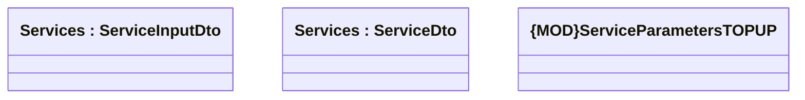

# TOPUP data

```mermaid
classDiagram
    class Services_ServiceInputDto["Services : ServiceInputDto"]
    class Services_ServiceDto["Services : ServiceDto"]
    class MOD_ServiceParametersTOPUP["{MOD}ServiceParametersTOPUP"]
```
