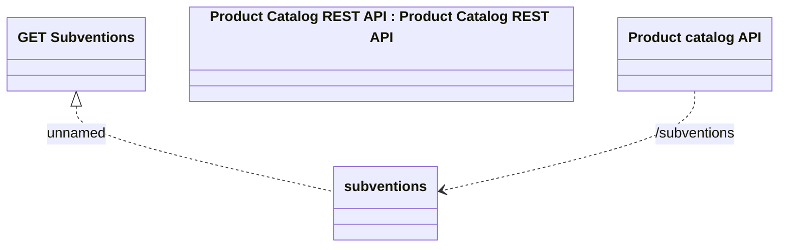

# Subventions API

- **Diagram Type**: Logical
- **Package**: HomerSelect/BSL/Modules/Product Catalog (PRC)/Interface Provided/Product Catalog REST API/Subventions
- **Diagram ID**: 148707
- **Elements**: 4
- **Connectors**: 2

