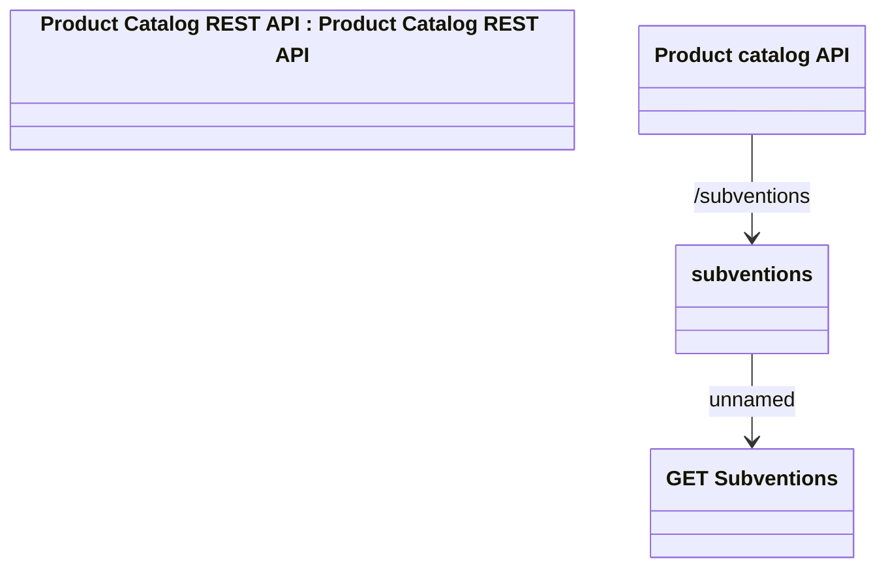

# Subventions API

```mermaid
classDiagram
    class GET_Subventions["GET Subventions"]
    class subventions["subventions"]
    class Product_Catalog_REST_API_Product_Catalog_REST_API["Product Catalog REST API : Product Catalog REST API"]
    class Product_catalog_API["Product catalog API"]
    subventions --> GET_Subventions : unnamed
    Product_catalog_API --> subventions : /subventions
```
