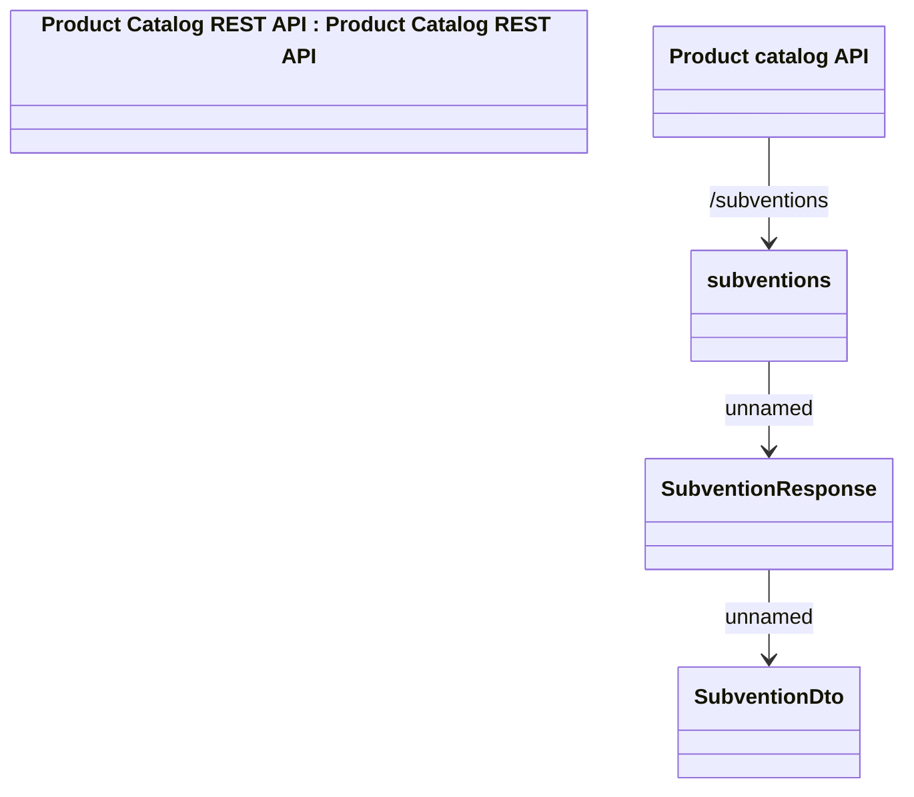

# Subventions

```mermaid
classDiagram
    class SubventionResponse["SubventionResponse"]
    class SubventionDto["SubventionDto"]
    class subventions["subventions"]
    class Product_Catalog_REST_API_Product_Catalog_REST_API["Product Catalog REST API : Product Catalog REST API"]
    class Product_catalog_API["Product catalog API"]
    subventions --> SubventionResponse : unnamed
    SubventionResponse --> SubventionDto : unnamed
    Product_catalog_API --> subventions : /subventions
```
