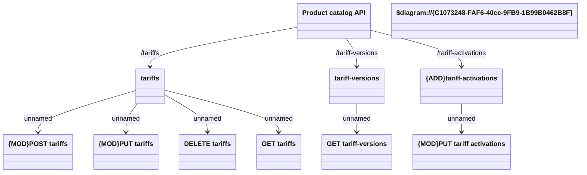

# Tariff API

```mermaid
classDiagram
    class MOD_PUT_tariff_activations["{MOD}PUT tariff activations"]
    class ADD_tariff_activations["{ADD}tariff-activations"]
    class Product_catalog_API["Product catalog API"]
    class diagram_C1073248_FAF6_40ce_9FB9_1B99B0462B8F["$diagram://{C1073248-FAF6-40ce-9FB9-1B99B0462B8F}"]
    class tariffs["tariffs"]
    class tariff_versions["tariff-versions"]
    class GET_tariff_versions["GET tariff-versions"]
    class MOD_PUT_tariffs["{MOD}PUT tariffs"]
    class MOD_POST_tariffs["{MOD}POST tariffs"]
    class GET_tariffs["GET tariffs"]
    class DELETE_tariffs["DELETE tariffs"]
    tariffs --> MOD_POST_tariffs : unnamed
    tariffs --> MOD_PUT_tariffs : unnamed
    tariff_versions --> GET_tariff_versions : unnamed
    tariffs --> DELETE_tariffs : unnamed
    tariffs --> GET_tariffs : unnamed
    ADD_tariff_activations --> MOD_PUT_tariff_activations : unnamed
    Product_catalog_API --> tariffs : /tariffs
    Product_catalog_API --> tariff_versions : /tariff-versions
    Product_catalog_API --> ADD_tariff_activations : /tariff-activations
```
