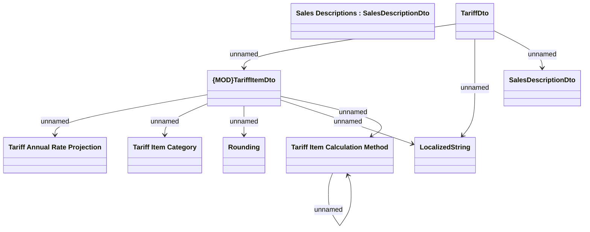

# TariffDto

```mermaid
classDiagram
    class Tariff_Item_Calculation_Method["Tariff Item Calculation Method"]
    class Sales_Descriptions_SalesDescriptionDto["Sales Descriptions : SalesDescriptionDto"]
    class SalesDescriptionDto["SalesDescriptionDto"]
    class LocalizedString["LocalizedString"]
    class Rounding["Rounding"]
    class Tariff_Item_Category["Tariff Item Category"]
    class Tariff_Annual_Rate_Projection["Tariff Annual Rate Projection"]
    class Tariff_Item_Calculation_Method["Tariff Item Calculation Method"]
    class MOD_TariffItemDto["{MOD}TariffItemDto"]
    class TariffDto["TariffDto"]
    TariffDto --> MOD_TariffItemDto : unnamed
    Tariff_Item_Calculation_Method --> Tariff_Item_Calculation_Method : unnamed
    MOD_TariffItemDto --> Tariff_Annual_Rate_Projection : unnamed
    MOD_TariffItemDto --> Tariff_Item_Category : unnamed
    MOD_TariffItemDto --> Rounding : unnamed
    MOD_TariffItemDto --> LocalizedString : unnamed
    TariffDto --> LocalizedString : unnamed
    TariffDto --> SalesDescriptionDto : unnamed
    MOD_TariffItemDto --> Tariff_Item_Calculation_Method : unnamed
```
