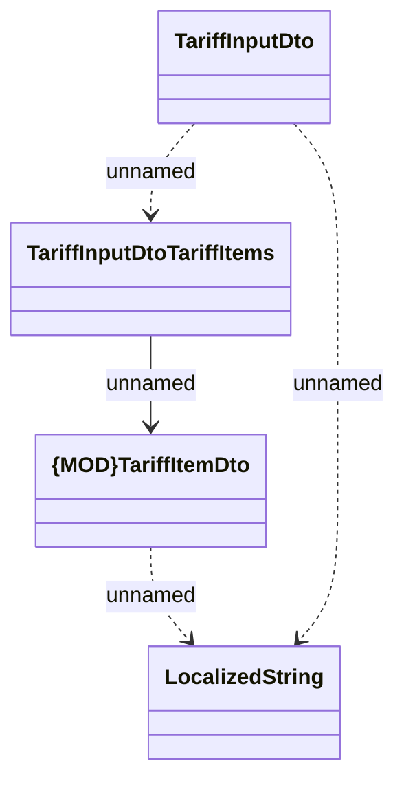

# TariffInputDto

- **Diagram Type**: Logical
- **Package**: HomerSelect/BSL/Modules/Product Catalog (PRC)/Interface Provided/Product Catalog REST API/Tariffs
- **Diagram ID**: 163132
- **Elements**: 4
- **Connectors**: 4

