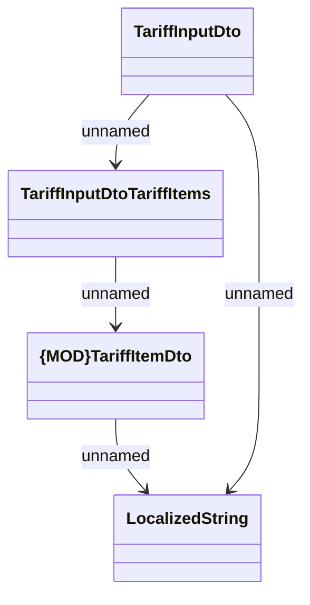

# TariffInputDto

```mermaid
classDiagram
    class LocalizedString["LocalizedString"]
    class MOD_TariffItemDto["{MOD}TariffItemDto"]
    class TariffInputDtoTariffItems["TariffInputDtoTariffItems"]
    class TariffInputDto["TariffInputDto"]
    TariffInputDto --> TariffInputDtoTariffItems : unnamed
    TariffInputDtoTariffItems --> MOD_TariffItemDto : unnamed
    MOD_TariffItemDto --> LocalizedString : unnamed
    TariffInputDto --> LocalizedString : unnamed
```
