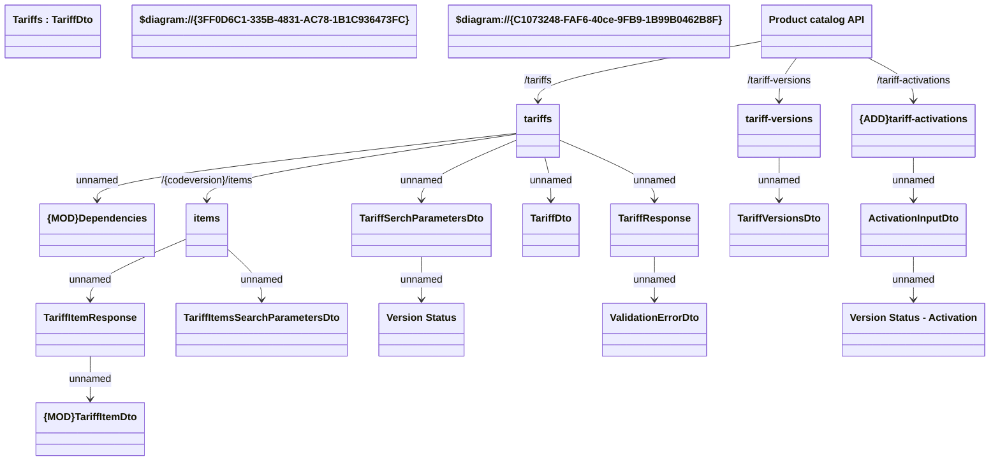

# Tariff

```mermaid
classDiagram
    class MOD_Dependencies["{MOD}Dependencies"]
    class ActivationInputDto["ActivationInputDto"]
    class Version_Status_Activation["Version Status - Activation"]
    class ADD_tariff_activations["{ADD}tariff-activations"]
    class MOD_TariffItemDto["{MOD}TariffItemDto"]
    class Tariffs_TariffDto["Tariffs : TariffDto"]
    class TariffItemResponse["TariffItemResponse"]
    class TariffItemsSearchParametersDto["TariffItemsSearchParametersDto"]
    class items["items"]
    class diagram_3FF0D6C1_335B_4831_AC78_1B1C936473FC["$diagram://{3FF0D6C1-335B-4831-AC78-1B1C936473FC}"]
    class diagram_C1073248_FAF6_40ce_9FB9_1B99B0462B8F["$diagram://{C1073248-FAF6-40ce-9FB9-1B99B0462B8F}"]
    class Product_catalog_API["Product catalog API"]
    class Version_Status["Version Status"]
    class TariffSerchParametersDto["TariffSerchParametersDto"]
    class TariffVersionsDto["TariffVersionsDto"]
    class TariffDto["TariffDto"]
    class TariffResponse["TariffResponse"]
    class ValidationErrorDto["ValidationErrorDto"]
    class tariff_versions["tariff-versions"]
    class tariffs["tariffs"]
    TariffSerchParametersDto --> Version_Status : unnamed
    ADD_tariff_activations --> ActivationInputDto : unnamed
    TariffItemResponse --> MOD_TariffItemDto : unnamed
    items --> TariffItemResponse : unnamed
    tariffs --> MOD_Dependencies : unnamed
    tariffs --> items : /{codeversion}/items
    tariffs --> TariffSerchParametersDto : unnamed
    tariff_versions --> TariffVersionsDto : unnamed
    tariffs --> TariffDto : unnamed
    tariffs --> TariffResponse : unnamed
    TariffResponse --> ValidationErrorDto : unnamed
    items --> TariffItemsSearchParametersDto : unnamed
    ActivationInputDto --> Version_Status_Activation : unnamed
    Product_catalog_API --> tariffs : /tariffs
    Product_catalog_API --> tariff_versions : /tariff-versions
    Product_catalog_API --> ADD_tariff_activations : /tariff-activations
```
