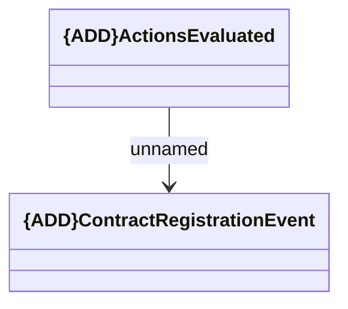

# ActionsEvaluated

```mermaid
classDiagram
    class ADD_ContractRegistrationEvent["{ADD}ContractRegistrationEvent"]
    class ADD_ActionsEvaluated["{ADD}ActionsEvaluated"]
    ADD_ActionsEvaluated --> ADD_ContractRegistrationEvent : unnamed
```
