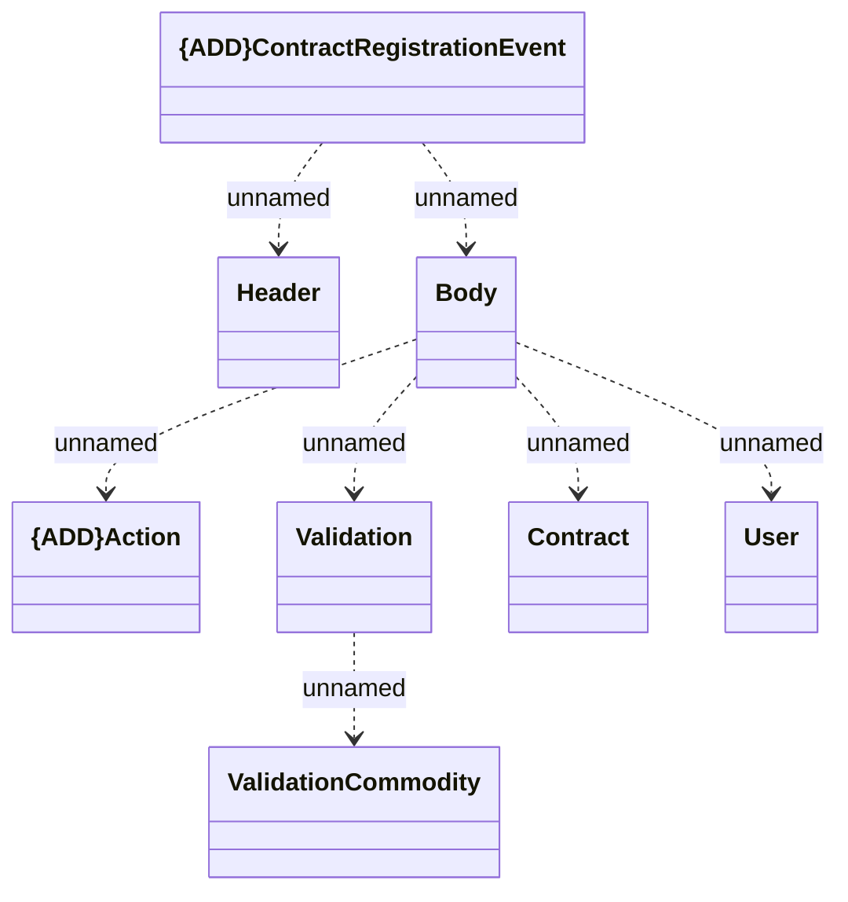

# ContractRegistrationEvent

- **Diagram Type**: Logical
- **Package**: HomerSelect/BSL/Modules/Registration module (REM)/Interface provided/Kafka/v1/Common/ContractRegistrationEvent
- **Diagram ID**: 156838
- **Elements**: 8
- **Connectors**: 7

