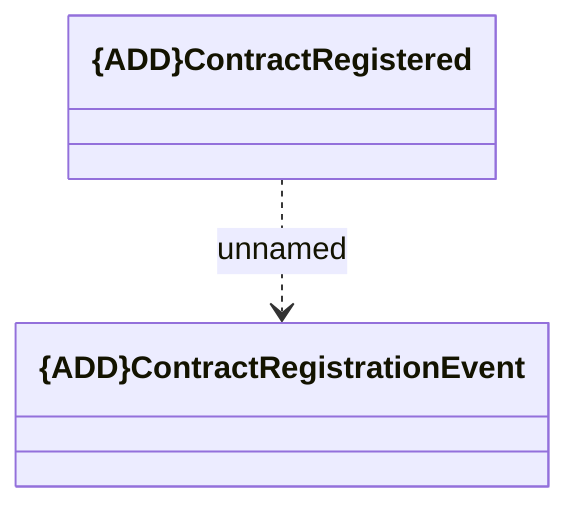

# ContractRegistered

- **Diagram Type**: Logical
- **Package**: HomerSelect/BSL/Modules/Registration module (REM)/Interface provided/Kafka/v1/ContractRegistered
- **Diagram ID**: 156802
- **Elements**: 2
- **Connectors**: 1

