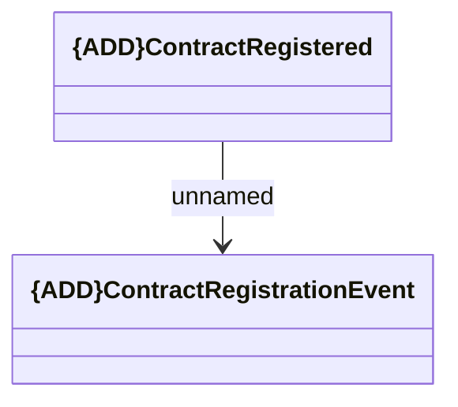

# ContractRegistered

```mermaid
classDiagram
    class ADD_ContractRegistrationEvent["{ADD}ContractRegistrationEvent"]
    class ADD_ContractRegistered["{ADD}ContractRegistered"]
    ADD_ContractRegistered --> ADD_ContractRegistrationEvent : unnamed
```
