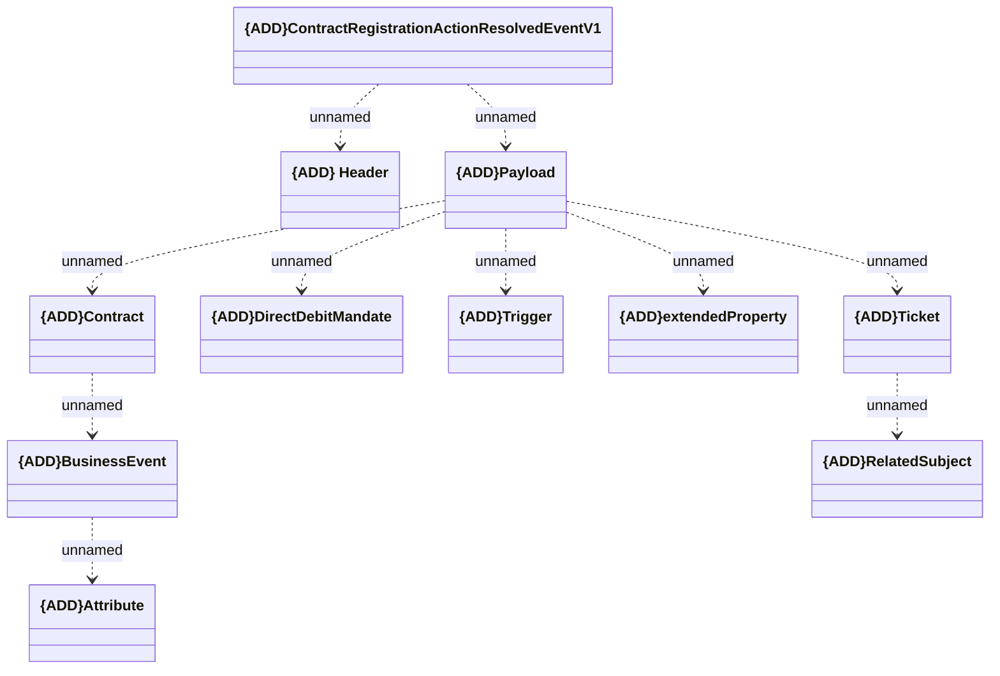

# ContractRegistrationActionResolvedEvent

- **Diagram Type**: Logical
- **Package**: HomerSelect/BSL/Modules/Registration module (REM)/Interface provided/RabbitMQ AsyncApi
- **Diagram ID**: 156781
- **Elements**: 11
- **Connectors**: 10

