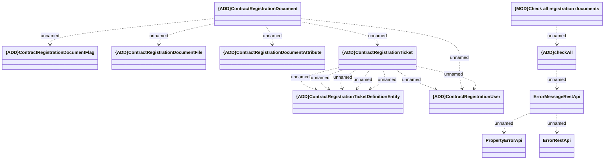

# checkAll

- **Diagram Type**: Logical
- **Package**: HomerSelect/BSL/Modules/Registration module (REM)/Interface provided/Registration management/contracts/checkAll
- **Diagram ID**: 156805
- **Elements**: 12
- **Connectors**: 16

