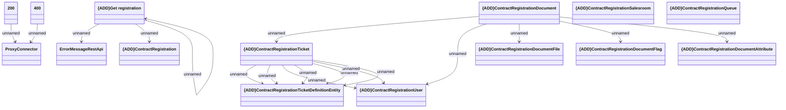

# getRegistration

```mermaid
classDiagram
    class ADD_Get_registration["{ADD}Get registration"]
    class ProxyConnector["ProxyConnector"]
    class ProxyConnector["ProxyConnector"]
    class ErrorMessageRestApi["ErrorMessageRestApi"]
    class ADD_Get_registration["{ADD}Get registration"]
    class ADD_ContractRegistration["{ADD}ContractRegistration"]
    class n_200["200"]
    class n_400["400"]
    class ADD_ContractRegistrationUser["{ADD}ContractRegistrationUser"]
    class ADD_ContractRegistrationDocumentFlag["{ADD}ContractRegistrationDocumentFlag"]
    class ADD_ContractRegistrationDocument["{ADD}ContractRegistrationDocument"]
    class ADD_ContractRegistrationTicketDefinitionEntity["{ADD}ContractRegistrationTicketDefinitionEntity"]
    class ADD_ContractRegistrationDocumentAttribute["{ADD}ContractRegistrationDocumentAttribute"]
    class ADD_ContractRegistrationDocumentFile["{ADD}ContractRegistrationDocumentFile"]
    class ADD_ContractRegistrationTicket["{ADD}ContractRegistrationTicket"]
    class ADD_ContractRegistrationSalesroom["{ADD}ContractRegistrationSalesroom"]
    class ADD_ContractRegistrationQueue["{ADD}ContractRegistrationQueue"]
    ADD_Get_registration --> ErrorMessageRestApi : unnamed
    ADD_Get_registration --> ADD_ContractRegistration : unnamed
    n_200 --> ProxyConnector : unnamed
    n_400 --> ProxyConnector : unnamed
    ADD_Get_registration --> ADD_Get_registration : unnamed
    ADD_ContractRegistrationTicket --> ADD_ContractRegistrationTicketDefinitionEntity : unnamed
    ADD_ContractRegistrationTicket --> ADD_ContractRegistrationTicketDefinitionEntity : unnamed
    ADD_ContractRegistrationDocument --> ADD_ContractRegistrationTicket : unnamed
    ADD_ContractRegistrationTicket --> ADD_ContractRegistrationUser : unnamed
    ADD_ContractRegistrationDocument --> ADD_ContractRegistrationUser : unnamed
    ADD_ContractRegistrationTicket --> ADD_ContractRegistrationTicketDefinitionEntity : unnamed
    ADD_ContractRegistrationTicket --> ADD_ContractRegistrationTicketDefinitionEntity : unnamed
    ADD_ContractRegistrationDocument --> ADD_ContractRegistrationDocumentFile : unnamed
    ADD_ContractRegistrationDocument --> ADD_ContractRegistrationDocumentFlag : unnamed
    ADD_ContractRegistrationTicket --> ADD_ContractRegistrationUser : unnamed
    ADD_ContractRegistrationDocument --> ADD_ContractRegistrationDocumentAttribute : unnamed
    ADD_ContractRegistrationTicket --> ADD_ContractRegistrationTicketDefinitionEntity : unnamed
```
