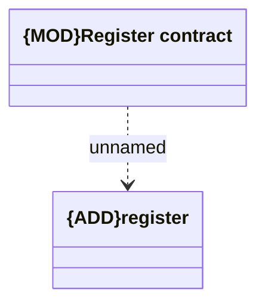

# register

- **Diagram Type**: Logical
- **Package**: HomerSelect/BSL/Modules/Registration module (REM)/Interface provided/Registration management/contracts/register
- **Diagram ID**: 156807
- **Elements**: 2
- **Connectors**: 1

