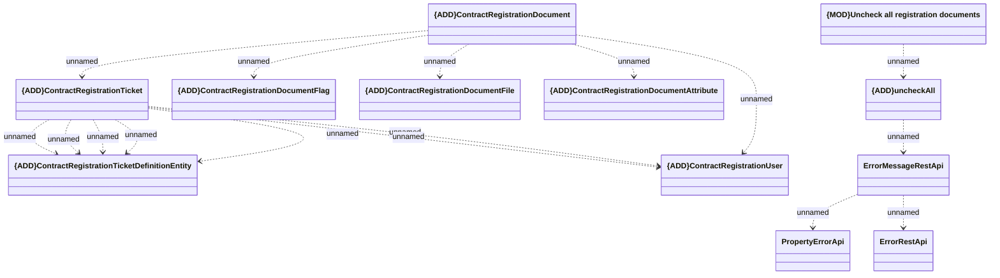

# uncheckAll

- **Diagram Type**: Logical
- **Package**: HomerSelect/BSL/Modules/Registration module (REM)/Interface provided/Registration management/contracts/uncheckAll
- **Diagram ID**: 156808
- **Elements**: 12
- **Connectors**: 16

