# checkDocument

- **Diagram Type**: Logical
- **Package**: HomerSelect/BSL/Modules/Registration module (REM)/Interface provided/Registration management/documents/checkDocument
- **Diagram ID**: 156809
- **Elements**: 12
- **Connectors**: 15

```mermaid
classDiagram
    class ADD_ContractRegistrationDocumentFlag["{ADD}ContractRegistrationDocumentFlag"]
    class ADD_ContractRegistrationUser["{ADD}ContractRegistrationUser"]
    class ADD_ContractRegistrationTicket["{ADD}ContractRegistrationTicket"]
    class ADD_ContractRegistrationTicketDefinitionEntity["{ADD}ContractRegistrationTicketDefinitionEntity"]
    class ADD_ContractRegistrationDocumentAttribute["{ADD}ContractRegistrationDocumentAttribute"]
    class ADD_ContractRegistrationDocumentFile["{ADD}ContractRegistrationDocumentFile"]
    class ADD_ContractRegistrationDocument["{ADD}ContractRegistrationDocument"]
    class MOD_Check_registration_document["{MOD}Check registration document"]
    class PropertyErrorApi["PropertyErrorApi"]
    class ErrorRestApi["ErrorRestApi"]
    class ErrorMessageRestApi["ErrorMessageRestApi"]
    class ADD_checkDocument["{ADD}checkDocument"]
    ADD_checkDocument ..> ErrorMessageRestApi : unnamed
    ErrorMessageRestApi ..> PropertyErrorApi : unnamed
    ErrorMessageRestApi ..> ErrorRestApi : unnamed
    ADD_ContractRegistrationDocument ..> ADD_ContractRegistrationUser : unnamed
    ADD_ContractRegistrationTicket ..> ADD_ContractRegistrationUser : unnamed
    ADD_ContractRegistrationDocument ..> ADD_ContractRegistrationDocumentFlag : unnamed
    ADD_ContractRegistrationTicket ..> ADD_ContractRegistrationTicketDefinitionEntity : unnamed
    ADD_ContractRegistrationTicket ..> ADD_ContractRegistrationTicketDefinitionEntity : unnamed
    ADD_ContractRegistrationTicket ..> ADD_ContractRegistrationTicketDefinitionEntity : unnamed
    ADD_ContractRegistrationDocument ..> ADD_ContractRegistrationTicket : unnamed
    ADD_ContractRegistrationTicket ..> ADD_ContractRegistrationUser : unnamed
    ADD_ContractRegistrationTicket ..> ADD_ContractRegistrationTicketDefinitionEntity : unnamed
    ADD_ContractRegistrationDocument ..> ADD_ContractRegistrationDocumentFile : unnamed
    ADD_ContractRegistrationTicket ..> ADD_ContractRegistrationTicketDefinitionEntity : unnamed
    ADD_ContractRegistrationDocument ..> ADD_ContractRegistrationDocumentAttribute : unnamed
```

