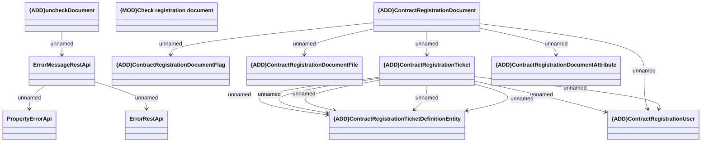

# uncheckDocument

```mermaid
classDiagram
    class PropertyErrorApi["PropertyErrorApi"]
    class ErrorRestApi["ErrorRestApi"]
    class ErrorMessageRestApi["ErrorMessageRestApi"]
    class ADD_uncheckDocument["{ADD}uncheckDocument"]
    class MOD_Check_registration_document["{MOD}Check registration document"]
    class ADD_ContractRegistrationDocumentFlag["{ADD}ContractRegistrationDocumentFlag"]
    class ADD_ContractRegistrationDocumentFile["{ADD}ContractRegistrationDocumentFile"]
    class ADD_ContractRegistrationTicket["{ADD}ContractRegistrationTicket"]
    class ADD_ContractRegistrationDocument["{ADD}ContractRegistrationDocument"]
    class ADD_ContractRegistrationTicketDefinitionEntity["{ADD}ContractRegistrationTicketDefinitionEntity"]
    class ADD_ContractRegistrationDocumentAttribute["{ADD}ContractRegistrationDocumentAttribute"]
    class ADD_ContractRegistrationUser["{ADD}ContractRegistrationUser"]
    ADD_uncheckDocument --> ErrorMessageRestApi : unnamed
    ErrorMessageRestApi --> PropertyErrorApi : unnamed
    ErrorMessageRestApi --> ErrorRestApi : unnamed
    ADD_ContractRegistrationTicket --> ADD_ContractRegistrationTicketDefinitionEntity : unnamed
    ADD_ContractRegistrationDocument --> ADD_ContractRegistrationTicket : unnamed
    ADD_ContractRegistrationTicket --> ADD_ContractRegistrationTicketDefinitionEntity : unnamed
    ADD_ContractRegistrationTicket --> ADD_ContractRegistrationTicketDefinitionEntity : unnamed
    ADD_ContractRegistrationTicket --> ADD_ContractRegistrationUser : unnamed
    ADD_ContractRegistrationTicket --> ADD_ContractRegistrationTicketDefinitionEntity : unnamed
    ADD_ContractRegistrationTicket --> ADD_ContractRegistrationTicketDefinitionEntity : unnamed
    ADD_ContractRegistrationDocument --> ADD_ContractRegistrationUser : unnamed
    ADD_ContractRegistrationDocument --> ADD_ContractRegistrationDocumentFile : unnamed
    ADD_ContractRegistrationTicket --> ADD_ContractRegistrationUser : unnamed
    ADD_ContractRegistrationDocument --> ADD_ContractRegistrationDocumentFlag : unnamed
    ADD_ContractRegistrationDocument --> ADD_ContractRegistrationDocumentAttribute : unnamed
```
