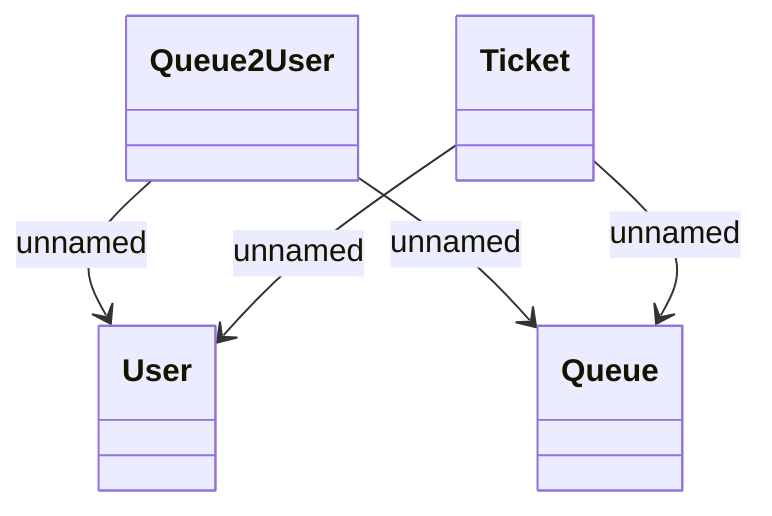

# Extended ticket

```mermaid
classDiagram
    class Queue2User["Queue2User"]
    class Queue["Queue"]
    class User["User"]
    class Ticket["Ticket"]
    Queue2User --> User : unnamed
    Ticket --> User : unnamed
    Queue2User --> Queue : unnamed
    Ticket --> Queue : unnamed
```
