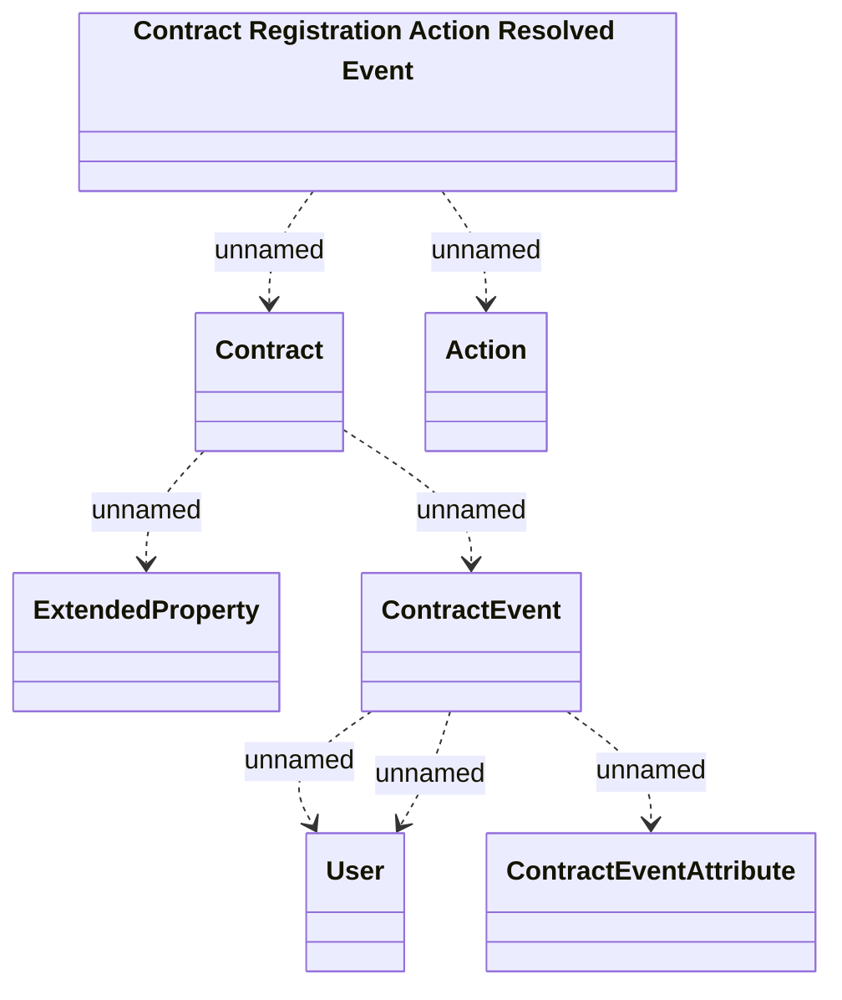

# Contract Registration Action Resolved Event

- **Diagram Type**: Logical
- **Package**: HomerSelect/BSL/Modules/Registration module (REM)/Requirements/CBL-17316 (CLM-5164) Registration based on REM module/Registration tickets orchestration analyses/Interface provided
- **Diagram ID**: 156813
- **Elements**: 7
- **Connectors**: 7

