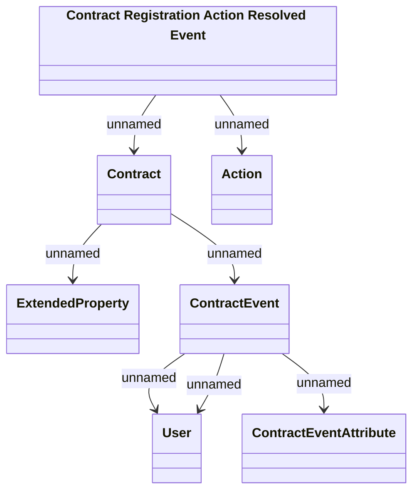

# Contract Registration Action Resolved Event

```mermaid
classDiagram
    class Contract["Contract"]
    class Action["Action"]
    class ExtendedProperty["ExtendedProperty"]
    class ContractEventAttribute["ContractEventAttribute"]
    class User["User"]
    class ContractEvent["ContractEvent"]
    class Contract_Registration_Action_Resolved_Event["Contract Registration Action Resolved Event"]
    Contract_Registration_Action_Resolved_Event --> Action : unnamed
    Contract_Registration_Action_Resolved_Event --> Contract : unnamed
    Contract --> ContractEvent : unnamed
    ContractEvent --> User : unnamed
    ContractEvent --> User : unnamed
    ContractEvent --> ContractEventAttribute : unnamed
    Contract --> ExtendedProperty : unnamed
```
