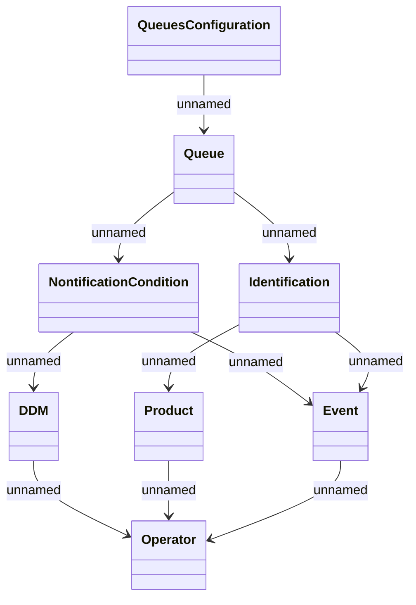

# Queues configuration

```mermaid
classDiagram
    class Operator["Operator"]
    class DDM["DDM"]
    class NontificationCondition["NontificationCondition"]
    class Product["Product"]
    class Event["Event"]
    class Identification["Identification"]
    class Queue["Queue"]
    class QueuesConfiguration["QueuesConfiguration"]
    QueuesConfiguration --> Queue : unnamed
    Queue --> Identification : unnamed
    NontificationCondition --> Event : unnamed
    Identification --> Event : unnamed
    Identification --> Product : unnamed
    Queue --> NontificationCondition : unnamed
    NontificationCondition --> DDM : unnamed
    DDM --> Operator : unnamed
    Product --> Operator : unnamed
    Event --> Operator : unnamed
```
