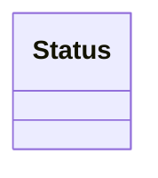

# Registration ticket

- **Diagram Type**: Logical
- **Package**: HomerSelect/BSL/Modules/Registration module (REM)/Requirements/CBL-17316 (CLM-5164) Registration based on REM module/Registration tickets orchestration analyses/Logical data model
- **Diagram ID**: 156814
- **Elements**: 1
- **Connectors**: 0

