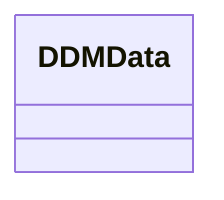

# Kafka messages

- **Diagram Type**: Logical
- **Package**: HomerSelect/BSL/Modules/Registration module (REM)/{MOD}Interface Consumed/Kafka messages
- **Diagram ID**: 157003
- **Elements**: 1
- **Connectors**: 0

