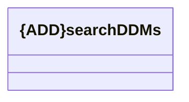

# searchDDMs

- **Diagram Type**: Logical
- **Package**: HomerSelect/BSL/Modules/Registration module (REM)/{MOD}Interface Consumed/REST/BSL/v1/searchDDMs
- **Diagram ID**: 156823
- **Elements**: 1
- **Connectors**: 0

