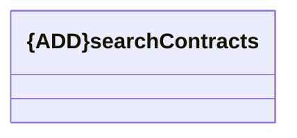

# searchContracts

- **Diagram Type**: Logical
- **Package**: HomerSelect/BSL/Modules/Registration module (REM)/{MOD}Interface Consumed/REST/COMA/v11/searchContracts
- **Diagram ID**: 156824
- **Elements**: 1
- **Connectors**: 0

