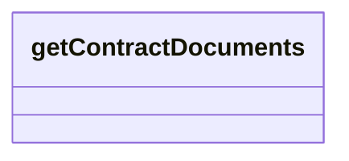

# getContractDocuments

- **Diagram Type**: Logical
- **Package**: HomerSelect/BSL/Modules/Registration module (REM)/{MOD}Interface Consumed/REST/COMA/v12/getContractDocuments
- **Diagram ID**: 156826
- **Elements**: 1
- **Connectors**: 0

