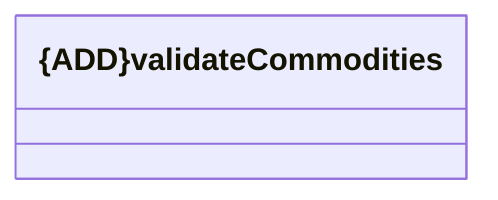

# validateCommodities

- **Diagram Type**: Logical
- **Package**: HomerSelect/BSL/Modules/Registration module (REM)/{MOD}Interface Consumed/REST/COMMODITY/v1/validateCommodities
- **Diagram ID**: 156828
- **Elements**: 1
- **Connectors**: 0

