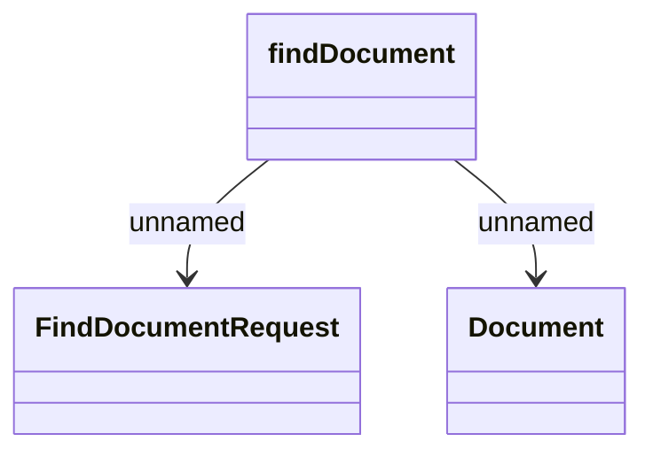

# findDocument

```mermaid
classDiagram
    class Document["Document"]
    class FindDocumentRequest["FindDocumentRequest"]
    class findDocument["findDocument"]
    findDocument --> FindDocumentRequest : unnamed
    findDocument --> Document : unnamed
```
