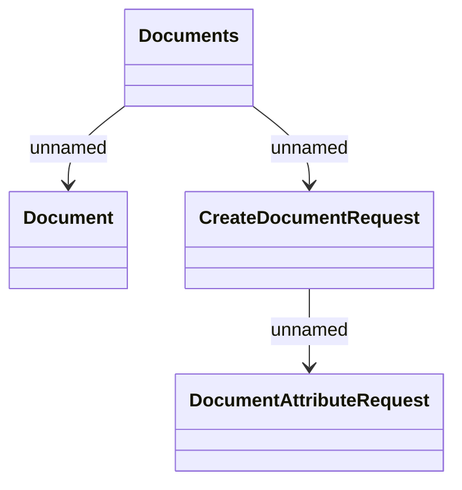

# CreateDocument

```mermaid
classDiagram
    class DocumentAttributeRequest["DocumentAttributeRequest"]
    class Document["Document"]
    class Documents["Documents"]
    class CreateDocumentRequest["CreateDocumentRequest"]
    Documents --> CreateDocumentRequest : unnamed
    Documents --> Document : unnamed
    CreateDocumentRequest --> DocumentAttributeRequest : unnamed
```
