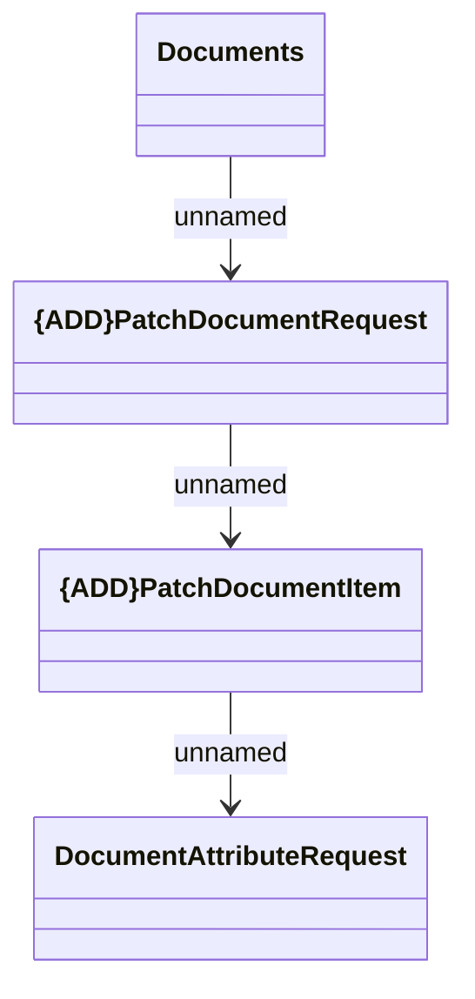

# PatchDocument

```mermaid
classDiagram
    class DocumentAttributeRequest["DocumentAttributeRequest"]
    class ADD_PatchDocumentItem["{ADD}PatchDocumentItem"]
    class ADD_PatchDocumentRequest["{ADD}PatchDocumentRequest"]
    class Documents["Documents"]
    Documents --> ADD_PatchDocumentRequest : unnamed
    ADD_PatchDocumentRequest --> ADD_PatchDocumentItem : unnamed
    ADD_PatchDocumentItem --> DocumentAttributeRequest : unnamed
```
