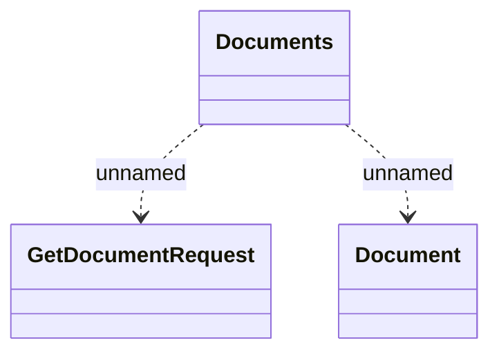

# getDocument

- **Diagram Type**: Logical
- **Package**: HomerSelect/BSL/Modules/Registration module (REM)/{MOD}Interface Consumed/REST/DMS/v2/getDocument
- **Diagram ID**: 156833
- **Elements**: 3
- **Connectors**: 2

