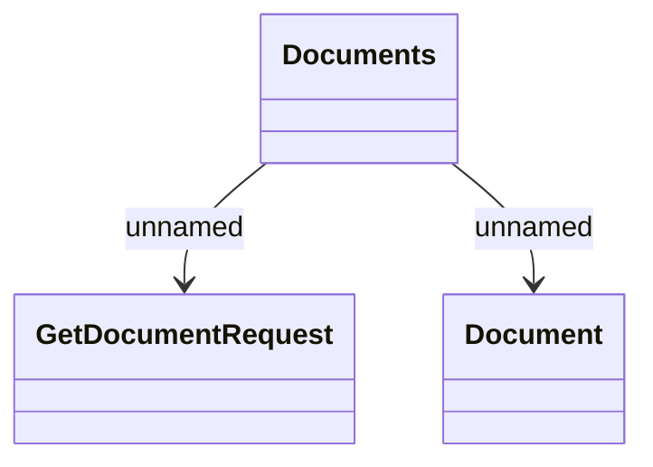

# getDocument

```mermaid
classDiagram
    class Document["Document"]
    class GetDocumentRequest["GetDocumentRequest"]
    class Documents["Documents"]
    Documents --> GetDocumentRequest : unnamed
    Documents --> Document : unnamed
```
