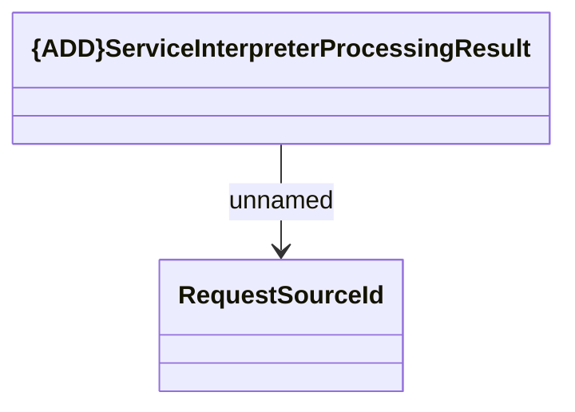

# ServiceInterpreterProcessingResult notification

- **Diagram Type**: Logical
- **Package**: HomerSelect/BSL/Modules/Service Interpreter (SIR)/Interface Provided/Generated Messages/ServiceInterpreterProcessingResult notification
- **Diagram ID**: 146630
- **Elements**: 2
- **Connectors**: 1

