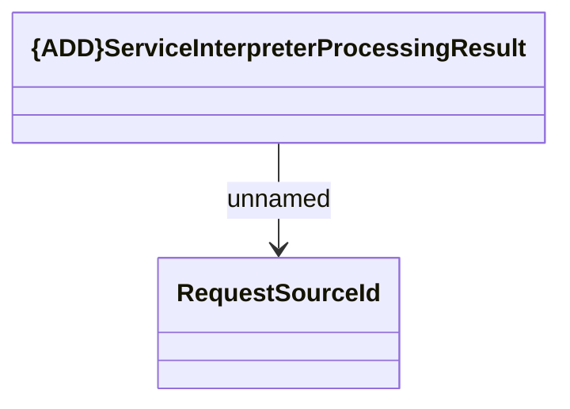

# ServiceInterpreterProcessingResult notification

```mermaid
classDiagram
    class RequestSourceId["RequestSourceId"]
    class ADD_ServiceInterpreterProcessingResult["{ADD}ServiceInterpreterProcessingResult"]
    ADD_ServiceInterpreterProcessingResult --> RequestSourceId : unnamed
```
