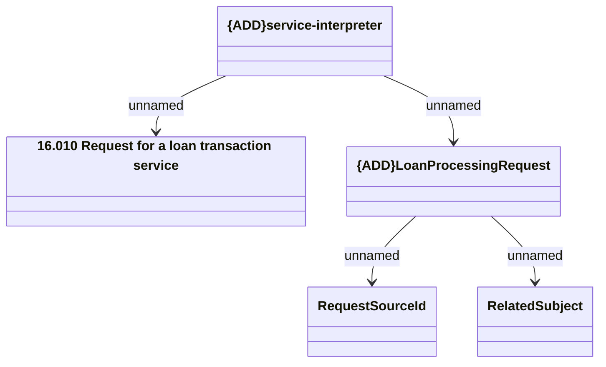

# SIR - Process a request for a loan

```mermaid
classDiagram
    class n_16_010_Request_for_a_loan_transaction_service["16.010 Request for a loan transaction service"]
    class RelatedSubject["RelatedSubject"]
    class RequestSourceId["RequestSourceId"]
    class ADD_LoanProcessingRequest["{ADD}LoanProcessingRequest"]
    class ADD_service_interpreter["{ADD}service-interpreter"]
    ADD_service_interpreter --> ADD_LoanProcessingRequest : unnamed
    ADD_LoanProcessingRequest --> RequestSourceId : unnamed
    ADD_LoanProcessingRequest --> RelatedSubject : unnamed
    ADD_service_interpreter --> n_16_010_Request_for_a_loan_transaction_service : unnamed
```
