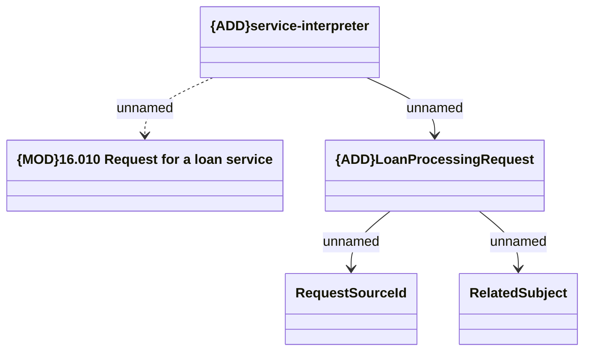

# SIR - Process a request for a loan

- **Diagram Type**: Logical
- **Package**: HomerSelect/BSL/Modules/Service Interpreter (SIR_NG)/Interface Provided/Web Services
- **Diagram ID**: 160386
- **Elements**: 5
- **Connectors**: 4

