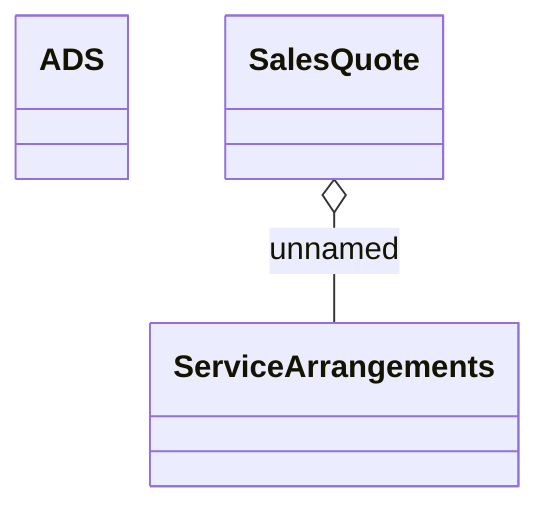

# ACCOUNT_CREATION Sales Quote mapping

- **Diagram Type**: Logical
- **Package**: HomerSelect/BSL/Modules/Service Interpreter (SIR_NG)/Requirement Model/CBL-27126 BREIT-82 - COMA, SUP, COS, SIR MVP Functionalities/ACCOUNT_CREATION Sales Quote mapping
- **Diagram ID**: 161636
- **Elements**: 3
- **Connectors**: 1

